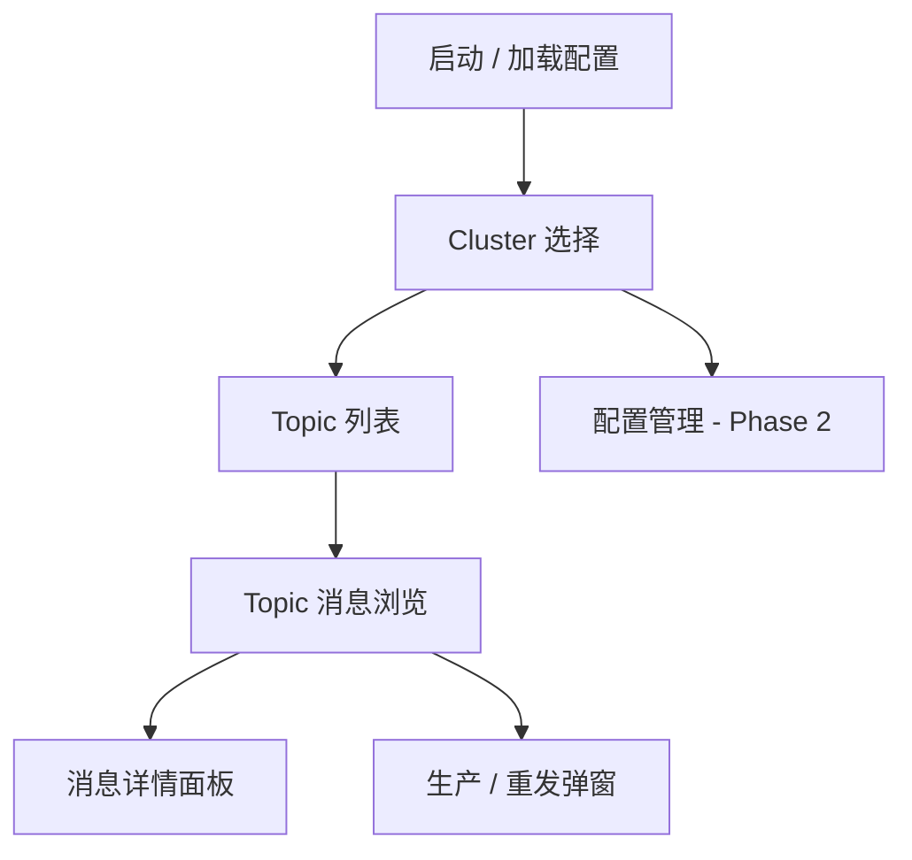
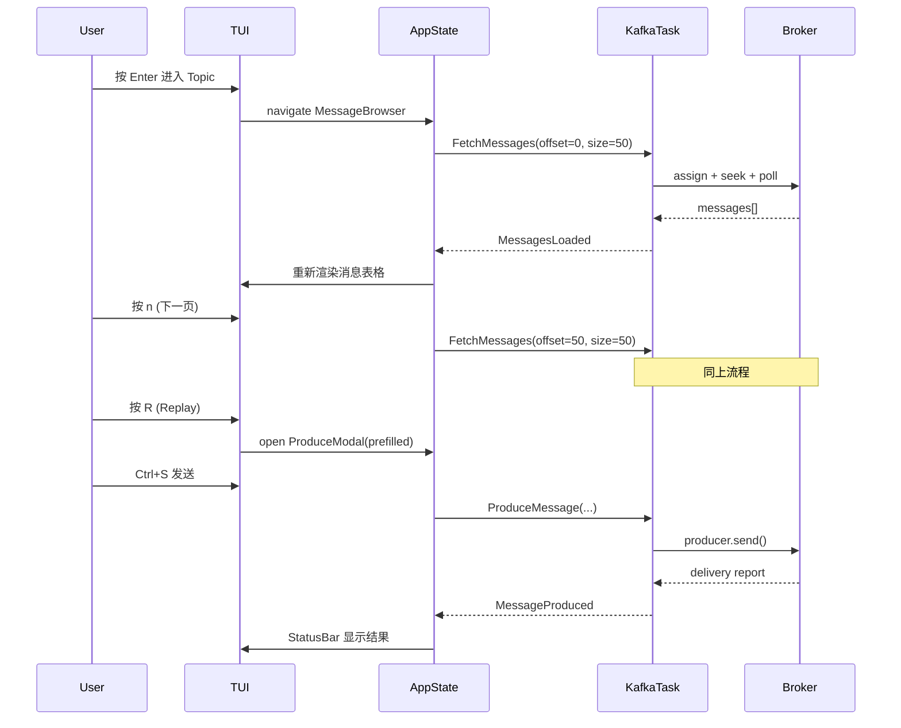

# Rust Kafka TUI — 产品设计文档

> 版本：v1.1  
> 日期：2026-06-17  
> 状态：已确认 — 见 [technical-implementation.md](./technical-implementation.md)

---

## 目录

1. [概述](#1-概述)
2. [目标用户与使用场景](#2-目标用户与使用场景)
3. [产品范围](#3-产品范围)
4. [信息架构与界面设计](#4-信息架构与界面设计)
5. [功能模块详细设计](#5-功能模块详细设计)
6. [分页模型设计](#6-分页模型设计)
7. [配置规范](#7-配置规范)
8. [技术架构](#8-技术架构)
9. [状态机与数据流](#9-状态机与数据流)
10. [快捷键规范](#10-快捷键规范)
11. [非功能性需求](#11-非功能性需求)
12. [分期交付计划](#12-分期交付计划)
13. [关键设计决策](#13-关键设计决策)
14. [项目结构](#14-项目结构)
15. [待确认事项](#15-待确认事项)

---

## 1. 概述

### 1.1 产品定位

**rust_kafka_tui** 是一款基于 [Ratatui](https://docs.rs/ratatui/latest/ratatui/) 构建的终端 Kafka 管理工具，面向需要在 SSH / 无 GUI 环境下操作 Kafka 的开发与运维人员。

| 维度     | 说明                                                             |
| -------- | ---------------------------------------------------------------- |
| 产品形态 | 终端 TUI 应用（Rust + Ratatui 0.30）                             |
| 核心价值 | 快速切换集群 → 浏览 Topic → **分页查看消息** → **生产/重发消息** |
| 配置参考 | [AKHQ](https://akhq.io/) YAML 配置结构，降低迁移成本             |
| 差异化   | 轻量、终端原生、无需浏览器，适合跳板机与 CI 环境                 |

### 1.2 核心功能闭环

```
加载配置 → 选择 Cluster → 浏览 Topic 列表 → 进入 Topic 消息浏览（分页）
    → 查看消息详情 → 单条 Replay / 手动 Produce
```

### 1.3 当前阶段重点

| 优先级 | 模块                     | 说明                             |
| ------ | ------------------------ | -------------------------------- |
| P0     | 查看（Browse）           | Topic 消息的分页浏览与详情展示   |
| P0     | 生产（Produce / Replay） | 单条消息重发与手动写入           |
| P1     | 配置与 Cluster 管理      | 多集群连接与切换                 |
| P1     | Topic 列表               | 当前 Cluster 下 Topic 展示与搜索 |

---

## 2. 目标用户与使用场景

### 2.1 目标用户

- **后端开发**：排查消息内容、验证生产逻辑
- **运维 / SRE**：跳板机上快速查看 Topic 数据、重放测试消息
- **测试工程师**：从生产 Topic 复制消息到测试 Topic

### 2.2 典型使用场景

**场景 A：消息排查**

运维人员 SSH 到跳板机，加载配置文件，选择生产 Cluster，搜索 `order-events` Topic，选定 partition 0，从 offset 10000 开始分页浏览，找到异常消息后查看完整 JSON 内容。

**场景 B：消息重放**

开发人员在测试环境选中一条生产消息，按 `R` 进入 Replay 弹窗，修改 Value 后发送到 `order-events-test` Topic，验证消费端逻辑。

**场景 C：手动写入**

测试人员打开 Produce 弹窗，输入 JSON 消息，发送到指定 Topic，确认 delivery report 中的 partition 与 offset。

---

## 3. 产品范围

### 3.1 MVP 范围内

- YAML 配置文件读取与多 Cluster 管理
- Cluster 切换与连接状态检测
- Topic 列表展示、搜索、刷新
- 单 Partition 消息分页浏览（Offset 驱动）
- 消息详情（Key / Value / Headers / Timestamp）
- JSON 自动格式化与 Raw 回退显示
- 单条 Replay（重发到指定 Topic）
- 手动 Produce（空白编辑器写入）
- 基础快捷键与错误提示

### 3.2 MVP 范围外（后续迭代）

- Consumer Group 管理
- Topic 创建 / 删除 / 配置修改
- ACL 管理
- KSQL / Kafka Connect 管理
- Schema Registry Avro 解码（Phase 2）
- 多 Partition 时间线合并浏览（Phase 2）
- 批量 Replay（Phase 2）
- 消息导出到文件（Phase 3）

---

## 4. 信息架构与界面设计

### 4.1 Screen 流转



### 4.2 全局布局

所有 Screen 共享统一的三段式布局：

```
┌─────────────────────────────────────────────────────────────┐
│ StatusBar: [Cluster: my-cluster] [broker:9092] [● 已连接]  │
├──────────┬──────────────────────────────────────────────────┤
│ Sidebar  │  Main Content                                    │
│          │                                                  │
│ Clusters │  （当前 Screen 内容区）                           │
│ Topics   │                                                  │
│          │                                                  │
├──────────┴──────────────────────────────────────────────────┤
│ Footer: 快捷键提示 | 分页信息 | 异步任务状态                  │
└─────────────────────────────────────────────────────────────┘
```

### 4.3 各 Screen 说明

| Screen       | 入口                | 主要内容                               |
| ------------ | ------------------- | -------------------------------------- |
| Cluster 选择 | 启动 / `c`          | Cluster 列表，当前选中项高亮           |
| Topic 列表   | 选中 Cluster 后     | Topic 名、Partition 数，支持搜索       |
| 消息浏览     | Topic 列表 `Enter`  | 消息表格 + Partition 选择 + 分页控件   |
| 消息详情     | 消息浏览 `Enter`    | Key / Value / Headers 完整展示         |
| 生产弹窗     | 消息浏览 `R` 或 `P` | 编辑 Key/Value/Headers，选择目标 Topic |

---

## 5. 功能模块详细设计

### 5.1 模块 A：连接与配置管理

#### 功能清单

| 功能            | MVP | 说明                                 |
| --------------- | --- | ------------------------------------ |
| 读取 YAML 配置  | ✅  | 启动时加载，支持 `--config` 指定路径 |
| 多 Cluster 列表 | ✅  | 从 `connections` 节解析              |
| 切换 Cluster    | ✅  | Sidebar 选择或数字快捷键             |
| 连接状态检测    | ✅  | Metadata 请求验证连通性              |
| 敏感信息管理    | ✅  | 密码通过环境变量引用，不写入明文     |
| 热重载配置      | ❌  | Phase 2                              |
| 只读模式        | ✅  | `allow-produce: false` 禁用写入      |

#### Cluster 切换行为

1. 关闭当前 Admin / Consumer / Producer 客户端
2. 使用新 Cluster 配置重建连接
3. 清空 Topic 缓存与消息缓存
4. 导航回 Topic 列表 Screen
5. StatusBar 更新连接状态（连接中 → 已连接 / 失败）

#### 连接失败处理

- StatusBar 显示 `[✗ 连接失败: <reason>]`
- Main Content 显示错误详情与重试提示（`r` 重试）
- 不阻塞 UI，允许切换其他 Cluster

---

### 5.2 模块 B：Topic 列表

#### 展示字段

| 列名       | 数据来源       | 说明                        |
| ---------- | -------------- | --------------------------- |
| Topic 名   | Kafka Metadata | 主列，支持搜索过滤          |
| Partitions | Kafka Metadata | Partition 数量              |
| Type       | 内部推断       | 内部 Topic（`__` 前缀）标记 |

#### 交互行为

| 操作           | 触发方式 | 行为                                  |
| -------------- | -------- | ------------------------------------- |
| 搜索           | `/`      | 模糊匹配 Topic 名，实时过滤           |
| 进入浏览       | `Enter`  | 跳转消息浏览 Screen，默认 partition 0 |
| 刷新           | `r`      | 重新拉取 Metadata                     |
| 切换内部 Topic | `i`      | 显示/隐藏 `__` 前缀的内部 Topic       |
| 返回 Cluster   | `Esc`    | 回到 Cluster 选择                     |

#### 数据缓存

- Topic 列表缓存在内存，Cluster 切换或手动刷新时更新
- 不持久化到磁盘

---

### 5.3 模块 C：Topic 消息浏览（核心 — 查看）

#### 消息表格列

| 列名      | 说明                            |
| --------- | ------------------------------- |
| #         | 当前页内序号（1 ~ page_size）   |
| Offset    | 消息在 Partition 中的 offset    |
| Timestamp | 消息时间戳（本地时区显示）      |
| Preview   | Key 或 Value 的截断预览（单行） |

#### 消息详情面板

选中消息后展示（可在同屏下方或独立面板）：

```
┌─ Message Detail ─────────────────────────────────────────────┐
│ Partition: 0    Offset: 1005    Timestamp: 2026-06-17 10:05  │
│ Key:   order-12345                                           │
│ Headers:                                                     │
│   content-type: application/json                             │
│   trace-id: abc-123                                          │
│ Value:                                                       │
│   {                                                          │
│     "orderId": "12345",                                      │
│     "amount": 99.9,                                          │
│     "status": "pending"                                      │
│   }                                                          │
└──────────────────────────────────────────────────────────────┘
```

#### 消息格式化策略

按优先级依次尝试：

1. **JSON Pretty-print**：Value 为合法 JSON 时自动格式化
2. **Raw UTF-8**：无法解析为 JSON 时，尝试 UTF-8 文本显示
3. **Raw Hex**：非 UTF-8 二进制数据，以 hex 显示
4. **截断**：超过 `max-message-length` 配置值时截断，Footer 提示 `[已截断，按 e 展开]`

格式切换：`f` 键在 auto / json / raw 之间循环。

#### 起始位置选项

| 选项           | 快捷键 / 入口  | 行为                                          |
| -------------- | -------------- | --------------------------------------------- |
| From Beginning | 进入浏览时默认 | `offset = log_start_offset`                   |
| From Latest    | `L`            | `offset = max(0, high_watermark - page_size)` |
| From Offset    | `g`            | 弹出输入框，用户指定起始 offset               |
| From Timestamp | Phase 2        | 按 timestamp seek 到对应 offset               |

---

### 5.4 模块 D：生产 / 重发（Replay）

#### 功能范围（MVP）

| 功能           | 说明                                                   |
| -------------- | ------------------------------------------------------ |
| 单条 Replay    | 从选中消息复制 Key / Value / Headers，发送到指定 Topic |
| 手动 Produce   | 空白编辑器，用户输入 Key / Value，发送到 Topic         |
| 目标 Topic     | 默认原 Topic，可编辑为任意 Topic                       |
| 目标 Partition | 默认自动分配（null），可选指定 partition               |
| 发送确认       | Delivery report 显示 partition、offset 或 error        |

#### Replay 流程

```
1. 在消息浏览页选中一条消息
2. 按 R 打开 Replay 弹窗
3. 弹窗预填：Key、Value、Headers（均可编辑）
4. 选择 Target Topic（默认当前 Topic）
5. 可选指定 Target Partition
6. 按 Ctrl+S 发送
7. StatusBar 显示结果：
   ✓ delivered → partition 0 @ offset 123456
   ✗ failed    → <error message>
```

#### 手动 Produce 流程

```
1. 在消息浏览页按 P
2. 打开空白 Compose 弹窗
3. 输入 Target Topic、Key（可选）、Value
4. 按 Ctrl+S 发送
5. 显示 delivery report
```

#### 安全约束

| 约束     | 说明                                                          |
| -------- | ------------------------------------------------------------- |
| 只读模式 | `allow-produce: false` 时禁用 R / P 快捷键                    |
| 二次确认 | 发往非 `*-test` / `*-dev` 后缀 Topic 时弹出 `确认发送? [Y/N]` |
| 配置覆盖 | 可在 Cluster 级别设置 `allow-produce: true/false`             |

---

## 6. 分页模型设计

### 6.1 设计原则

Kafka 的消息寻址基于 **Partition + Offset**，不支持 SQL 式的 `LIMIT/OFFSET` 分页。本工具的分页模型必须与 Kafka 语义一致。

**分页单元定义：**

```
Page = (topic, partition, start_offset, page_size)
```

### 6.2 浏览模式

| 模式                     | MVP     | 说明                               |
| ------------------------ | ------- | ---------------------------------- |
| 单 Partition 模式        | ✅      | 选定 partition，按 offset 翻页     |
| Merged 多 Partition 模式 | Phase 2 | 多 partition 按 timestamp 合并排序 |

**MVP 采用单 Partition 模式**，语义清晰，实现可靠。

### 6.3 分页 UI

```
Topic: order-events  |  Partition: [0 ▼]  |  Start: offset 1000

┌──────┬─────────┬──────────────────┬─────────────────────────────┐
│ #    │ Offset  │ Timestamp        │ Preview                     │
├──────┼─────────┼──────────────────┼─────────────────────────────┤
│ 1    │ 1000    │ 2026-06-17 10:00 │ {"orderId":"A001"...        │
│ 2    │ 1001    │ 2026-06-17 10:01 │ {"orderId":"A002"...        │
│ ...  │ ...     │ ...              │ ...                         │
│ 50   │ 1049    │ 2026-06-17 10:05 │ {"orderId":"A050"...        │
└──────┴─────────┴──────────────────┴─────────────────────────────┘

Footer: Page 21 | offset 1000–1049 / 50000 total | [◀ Prev] [Next ▶] [G Go]
```

### 6.4 翻页逻辑

```
当前页: start_offset = N, page_size = S

下一页: start_offset = N + S
上一页: start_offset = max(log_start_offset, N - S)
跳转:   用户输入 target_offset → seek 后拉取 S 条
首页:   start_offset = log_start_offset
末页:   start_offset = max(0, high_watermark - S)
```

### 6.5 边界处理

| 场景                              | 处理方式                                         |
| --------------------------------- | ------------------------------------------------ |
| `start_offset < log_start_offset` | Clamp 到 `log_start_offset`                      |
| `start_offset >= high_watermark`  | 显示空页，Footer 提示「已到末尾」                |
| 末页不足 page_size 条             | 显示实际条数，Footer 标注                        |
| Partition 切换                    | 重置 `start_offset = log_start_offset`，重新拉取 |
| 拉取超时                          | Footer 显示 `[超时，按 r 重试]`，保留当前页      |

### 6.6 实现要点（rdkafka）

```rust
// 伪代码 — 单页消息拉取
consumer.assign(&[TopicPartition::new(topic, partition, Offset::Offset(start))])?;
consumer.seek(topic, partition, start, timeout)?;

let mut messages = Vec::new();
while messages.len() < page_size {
    match consumer.poll(poll_timeout) {
        Some(Ok(msg)) => messages.push(msg),
        Some(Err(e)) if e.is_partition_eof() => break,
        Some(Err(e)) => return Err(e),
        None => break, // poll timeout
    }
}
```

### 6.7 缓存策略

| 策略               | MVP     | 说明                              |
| ------------------ | ------- | --------------------------------- |
| 当前页内存缓存     | ✅      | 保留当前页消息数据                |
| 上一页 offset 记录 | ✅      | 支持 Prev 快速回退，无需重复 seek |
| 多页 LRU 缓存      | Phase 2 | 缓存最近 N 页，加速来回翻页       |
| 磁盘持久化         | ❌      | 不做                              |

---

## 7. 配置规范

### 7.1 配置文件路径

| 优先级     | 路径                              |
| ---------- | --------------------------------- |
| 命令行指定 | `--config /path/to/config.yaml`   |
| 默认路径   | `~/.config/kafka-tui/config.yaml` |
| 项目本地   | `./config.yaml`（开发用）         |

### 7.2 配置结构

```yaml
# config.example.yaml

connections:
    my-cluster:
        properties:
            bootstrap.servers: 'kafka-broker-1:9092,kafka-broker-2:9092'
            # security.protocol: "SASL_SSL"
            # sasl.mechanism: "PLAIN"
            # sasl.username: "${KAFKA_USERNAME}"
            # sasl.password: "${KAFKA_PASSWORD}"
        schema-registry:
            url: 'http://schema-registry:8081' # 可选，Phase 2
        allow-produce: true # 是否允许写入，默认 true

    dev-cluster:
        properties:
            bootstrap.servers: 'localhost:9092'
        allow-produce: true

topic:
    replication: 3 # Phase 3 — Topic 管理
    partition: 3

topic-data:
    page-size: 50 # 每页消息数
    poll-timeout-ms: 1000 # 单次 poll 超时（毫秒）
    max-message-length: 1000000 # 消息展示最大字节数
    default-format: auto # auto | json | raw
```

### 7.3 配置项说明

| 配置项                                   | 类型   | 默认值    | 说明                                     |
| ---------------------------------------- | ------ | --------- | ---------------------------------------- |
| `connections.<name>.properties`          | map    | 必填      | Kafka 客户端 properties，同 rdkafka 配置 |
| `connections.<name>.schema-registry.url` | string | 可选      | Schema Registry 地址                     |
| `connections.<name>.allow-produce`       | bool   | `true`    | 是否允许 Produce / Replay                |
| `topic.replication`                      | int    | `3`       | 默认副本数（Phase 3）                    |
| `topic.partition`                        | int    | `3`       | 默认分区数（Phase 3）                    |
| `topic-data.page-size`                   | int    | `50`      | 分页大小                                 |
| `topic-data.poll-timeout-ms`             | int    | `1000`    | Consumer poll 超时                       |
| `topic-data.max-message-length`          | int    | `1000000` | 消息展示截断阈值                         |
| `topic-data.default-format`              | string | `auto`    | 默认消息格式                             |

### 7.4 环境变量引用

配置值支持 `${ENV_VAR}` 语法，运行时替换：

```yaml
sasl.username: '${KAFKA_USERNAME}'
sasl.password: '${KAFKA_PASSWORD}'
```

未找到环境变量时启动报错并提示。

---

## 8. 技术架构

### 8.1 分层架构

```
┌─────────────────────────────────────────┐
│  ui/          Ratatui 渲染 + 键盘事件    │
├─────────────────────────────────────────┤
│  app/         AppState + Screen 状态机   │
├─────────────────────────────────────────┤
│  service/     业务逻辑层                 │
│               TopicService               │
│               MessageService             │
│               ProduceService             │
├─────────────────────────────────────────┤
│  kafka/       rdkafka 封装               │
│               AdminClient                │
│               Consumer                   │
│               Producer                   │
├─────────────────────────────────────────┤
│  config/      YAML 解析 + 校验           │
└─────────────────────────────────────────┘
```

### 8.2 依赖选型

| Crate        | 版本   | 用途                                        |
| ------------ | ------ | ------------------------------------------- |
| `ratatui`    | 0.30   | TUI 框架                                    |
| `crossterm`  | latest | 终端 IO（键盘/鼠标/resize）                 |
| `rdkafka`    | latest | Kafka 客户端（Admin / Consumer / Producer） |
| `tokio`      | 1.x    | 异步运行时                                  |
| `serde`      | 1.x    | 序列化                                      |
| `serde_yaml` | 0.9    | YAML 配置解析                               |
| `serde_json` | 1.x    | JSON 格式化                                 |
| `anyhow`     | 1.x    | 错误处理                                    |
| `thiserror`  | 1.x    | 自定义错误类型                              |
| `tracing`    | 0.1    | 结构化日志（输出到文件，不污染 TUI）        |
| `clap`       | 4.x    | CLI 参数解析                                |

### 8.3 异步与 TUI 协作模型

Ratatui 渲染是同步的，Kafka IO 是阻塞/异步的，必须解耦：

```
┌──────────────┐     mpsc channel     ┌──────────────┐
│  Main Thread │ ◄─────────────────── │  Tokio Tasks │
│  (TUI 渲染)  │ ───────────────────► │  (Kafka IO)  │
└──────────────┘     mpsc channel     └──────────────┘
```

**主循环伪代码：**

```rust
loop {
    tokio::select! {
        // 键盘事件
        Some(event) = keyboard_rx.recv() => {
            app.handle_event(event);
        }
        // Kafka 异步结果
        Some(result) = kafka_rx.recv() => {
            app.handle_kafka_result(result);
        }
        // 定时 tick（loading 动画、连接心跳）
        _ = tick_interval.tick() => {
            app.on_tick();
        }
    }

    if app.should_quit {
        break;
    }

    terminal.draw(|f| ui::render(f, &app))?;
}
```

**原则：**

- 所有 Kafka 操作在 `tokio::spawn` 后台 task 中执行
- 结果通过 `mpsc::channel` 发送到主线程
- 主线程绝不阻塞在 Kafka IO 上
- 异步任务进行中，Footer 显示 loading 状态

### 8.4 错误处理策略

| 层级           | 策略                                        |
| -------------- | ------------------------------------------- |
| Kafka 连接失败 | StatusBar 显示错误，允许重试 / 切换 Cluster |
| 消息拉取失败   | Footer 显示错误，保留当前页，按 `r` 重试    |
| Produce 失败   | 弹窗内显示 error detail                     |
| 配置解析失败   | 启动时 stderr 输出并 exit(1)                |
| 未预期 panic   | `tracing` 写日志文件，TUI 显示友好错误页    |

---

## 9. 状态机与数据流

### 9.1 AppState 核心结构

```rust
pub struct App {
    pub config: AppConfig,
    pub current_cluster: Option<String>,
    pub connection_status: ConnectionStatus,
    pub screen: Screen,
    pub topics: Vec<TopicInfo>,
    pub topic_filter: String,
    pub messages: MessagePage,
    pub selected_index: usize,
    pub async_tasks: Vec<AsyncTaskId>,
    pub notification: Option<Notification>,
    pub should_quit: bool,
}

pub enum Screen {
    ClusterSelect,
    TopicList,
    MessageBrowser {
        topic: String,
        partition: i32,
        start_offset: i64,
    },
    MessageDetail,
    ProduceModal(ProduceDraft),
}

pub struct MessagePage {
    pub messages: Vec<KafkaMessage>,
    pub start_offset: i64,
    pub page_size: usize,
    pub high_watermark: i64,
    pub log_start_offset: i64,
    pub loading: bool,
}
```

### 9.2 异步任务类型

```rust
pub enum KafkaCommand {
    Connect { cluster: String },
    FetchTopics,
    FetchMessages {
        topic: String,
        partition: i32,
        start_offset: i64,
        page_size: usize,
    },
    ProduceMessage {
        topic: String,
        partition: Option<i32>,
        key: Option<Vec<u8>>,
        value: Vec<u8>,
        headers: Vec<(String, Vec<u8>)>,
    },
}

pub enum KafkaEvent {
    Connected { cluster: String },
    ConnectionFailed { cluster: String, error: String },
    TopicsLoaded { topics: Vec<TopicInfo> },
    MessagesLoaded { page: MessagePage },
    MessagesFailed { error: String },
    MessageProduced { partition: i32, offset: i64 },
    ProduceFailed { error: String },
}
```

### 9.3 数据流示意



---

## 10. 快捷键规范

### 10.1 全局快捷键

| 键    | 功能                         |
| ----- | ---------------------------- |
| `q`   | 退出应用                     |
| `?`   | 显示帮助弹窗                 |
| `Esc` | 返回上一级 Screen / 关闭弹窗 |

### 10.2 Cluster 选择

| 键             | 功能                  |
| -------------- | --------------------- |
| `↑/↓` 或 `j/k` | 选择 Cluster          |
| `Enter`        | 连接并进入 Topic 列表 |

### 10.3 Topic 列表

| 键             | 功能               |
| -------------- | ------------------ |
| `↑/↓` 或 `j/k` | 选择 Topic         |
| `Enter`        | 进入消息浏览       |
| `/`            | 搜索过滤           |
| `r`            | 刷新 Topic 列表    |
| `i`            | 切换显示内部 Topic |
| `Esc`          | 返回 Cluster 选择  |

### 10.4 消息浏览

| 键             | 功能                          |
| -------------- | ----------------------------- |
| `↑/↓` 或 `j/k` | 选择消息                      |
| `Enter`        | 展开/收起消息详情             |
| `n` 或 `]`     | 下一页                        |
| `p` 或 `[`     | 上一页                        |
| `g`            | Go to offset（输入框）        |
| `G`            | 跳到首页（From Beginning）    |
| `L`            | 跳到末页（From Latest）       |
| `P` 或 `Tab`   | 切换 Partition                |
| `f`            | 切换消息格式（auto/json/raw） |
| `R`            | Replay 选中消息               |
| `N`            | 新建 Produce（空白）          |
| `r`            | 重新加载当前页                |
| `Esc`          | 返回 Topic 列表               |

### 10.5 生产弹窗

| 键       | 功能         |
| -------- | ------------ |
| `Tab`    | 切换编辑字段 |
| `Ctrl+S` | 发送         |
| `Esc`    | 取消         |

---

## 11. 非功能性需求

### 11.1 性能

| 指标           | 目标                                 |
| -------------- | ------------------------------------ |
| 启动到首屏     | < 2s（含配置加载）                   |
| Topic 列表加载 | < 3s（1000 个 Topic 以内）           |
| 单页消息加载   | < 2s（page_size=50）                 |
| 翻页响应       | < 1s（seek + poll）                  |
| UI 帧率        | 渲染不阻塞，异步任务期间 UI 仍可响应 |

### 11.2 可靠性

- Kafka 连接断开时自动检测并在 StatusBar 提示
- 异步任务超时后允许用户重试，不 crash
- 配置文件格式错误时给出明确的行号与字段提示

### 11.3 安全

- 配置文件中的密码字段必须使用 `${ENV_VAR}` 引用
- 支持 Cluster 级别 `allow-produce: false` 只读模式
- 发往非 test/dev Topic 时二次确认
- 日志文件不包含消息内容（可配置）

### 11.4 兼容性

- 支持 Kafka 2.x / 3.x
- 支持 macOS / Linux（TUI 终端环境）
- 终端最小尺寸：80×24

---

## 12. 分期交付计划

### Phase 1 — MVP（预计 2–3 周）

**目标：可用的 Topic 浏览 + 消息生产工具**

- [ ] 项目脚手架（Cargo.toml、目录结构、CI）
- [ ] YAML 配置解析 + 环境变量替换
- [ ] 多 Cluster 连接与切换
- [ ] Topic 列表 + 搜索 + 刷新
- [ ] 单 Partition 消息分页浏览
    - [ ] Offset 翻页（Prev / Next）
    - [ ] Go to offset
    - [ ] From Beginning / From Latest
- [ ] 消息详情展示（JSON / Raw）
- [ ] 单条 Replay
- [ ] 手动 Produce
- [ ] 全局快捷键 + 帮助页
- [ ] 基础错误处理与 StatusBar 提示
- [ ] `config.example.yaml` + README

**验收标准：**

1. 能加载配置连接 localhost Kafka
2. 能浏览 Topic 列表并搜索
3. 能分页浏览指定 Topic 的消息
4. 能 Replay 一条消息到指定 Topic
5. 能手动 Produce 一条 JSON 消息

### Phase 2 — 增强（预计 2 周）

- [ ] Timestamp 定位（From Timestamp）
- [ ] SASL / SSL 完整认证支持
- [ ] Schema Registry Avro 解码
- [ ] Merged 多 Partition 时间线浏览
- [ ] 批量 Replay（选中范围）
- [ ] 多页 LRU 缓存
- [ ] 配置热重载
- [ ] 消息 Value 复制到剪贴板

### Phase 3 — 扩展（按需）

- [ ] Consumer Group 查看与 Lag 监控
- [ ] Topic 创建 / 删除
- [ ] 消息导出到文件（JSON / CSV）
- [ ] 多 Cluster 对比视图
- [ ] 插件化消息解码器

---

## 13. 关键设计决策

| #   | 决策点       | 选择                       | 理由                           | 备选方案                    |
| --- | ------------ | -------------------------- | ------------------------------ | --------------------------- |
| 1   | 分页模型     | Offset-based，单 Partition | 与 Kafka 语义一致，实现可靠    | SQL 式页码（❌ 语义不匹配） |
| 2   | 配置格式     | YAML，兼容 AKHQ 结构       | 降低从 AKHQ 迁移成本           | TOML / JSON                 |
| 3   | Kafka 客户端 | rdkafka                    | 生态最成熟，性能最好           | kafka-rs（功能较少）        |
| 4   | 异步模型     | tokio + mpsc channel       | TUI 不阻塞，标准 Rust 异步方案 | 同步阻塞（❌ UI 卡顿）      |
| 5   | Replay 范围  | MVP 单条                   | 风险可控，满足排查需求         | 批量 Replay（Phase 2）      |
| 6   | 消息格式     | auto 检测 JSON             | 覆盖 90% 场景                  | 仅 Raw（体验差）            |
| 7   | 安全默认值   | 非 test Topic 二次确认     | 防止误操作生产环境             | 无确认（❌ 风险高）         |
| 8   | 日志         | tracing 写文件             | 不污染 TUI 界面                | println（❌ 干扰 UI）       |

---

## 14. 项目结构

```
rust_kafka_tui/
├── Cargo.toml
├── config.example.yaml
├── README.md
├── docs/
│   └── product-design.md          # 本文档
├── src/
│   ├── main.rs                    # 入口：CLI 解析、终端初始化、主循环
│   ├── app/
│   │   ├── mod.rs
│   │   ├── state.rs               # AppState、Screen 枚举
│   │   └── event.rs               # 键盘事件处理、状态转换
│   ├── config/
│   │   └── mod.rs                 # YAML 解析、校验、env 替换
│   ├── kafka/
│   │   ├── mod.rs
│   │   ├── admin.rs               # AdminClient 封装（Metadata）
│   │   ├── consumer.rs            # Consumer 封装（seek + poll）
│   │   └── producer.rs            # Producer 封装（send + delivery）
│   ├── service/
│   │   ├── mod.rs
│   │   ├── topic.rs               # TopicService：列表、搜索
│   │   ├── message.rs             # MessageService：分页拉取、格式化
│   │   └── produce.rs             # ProduceService：Replay、手动写入
│   └── ui/
│       ├── mod.rs                 # 顶层 render 路由
│       ├── components/
│       │   ├── mod.rs
│       │   ├── status_bar.rs
│       │   ├── footer.rs
│       │   └── table.rs           # 通用表格组件
│       ├── cluster.rs             # Cluster 选择 Screen
│       ├── topic_list.rs          # Topic 列表 Screen
│       ├── message_browser.rs     # 消息浏览 Screen
│       ├── message_detail.rs      # 消息详情面板
│       ├── produce_modal.rs       # 生产/重发弹窗
│       └── help.rs                # 帮助弹窗
└── tests/
    └── config_test.rs             # 配置解析单元测试
```

---

## 15. 已确认事项

以下事项已于 2026-06-17 确认，技术实施方案见 [technical-implementation.md](./technical-implementation.md)。

| #   | 问题                                                         | 确认结果                       | 状态   |
| --- | ------------------------------------------------------------ | ------------------------------ | ------ |
| 1   | MVP 分页是否先做「单 Partition 模式」？                      | **多 Partition 合并模式**（同时保留单 Partition 切换） | ✅ 已确认 |
| 2   | 首批是否支持 SASL/SSL，还是先做 plain localhost？            | **首批支持 SASL/SSL**          | ✅ 已确认 |
| 3   | MVP 是否需要 Schema Registry Avro 解码？                     | **支持 Schema Registry Avro 解码** | ✅ 已确认 |
| 4   | 是否需要只读模式（`allow-produce: false`）？                 | **支持只读模式**               | ✅ 已确认 |
| 5   | 默认配置文件路径 `~/.config/kafka-tui/config.yaml` 是否 OK？ | **采用该默认路径**             | ✅ 已确认 |
| 6   | 产品名称是否确定为 `kafka-tui`？                             | **确定为 `kafka-tui`**         | ✅ 已确认 |
| 7   | 是否需要在 MVP 支持消息 Value 复制到剪贴板？                 | **支持剪贴板复制**             | ✅ 已确认 |

---

## 附录 A：术语表

| 术语             | 说明                                                       |
| ---------------- | ---------------------------------------------------------- |
| Cluster          | 配置文件中的一个 Kafka 连接，包含 bootstrap.servers 等属性 |
| Partition        | Topic 的分区，消息按 offset 有序存储                       |
| Offset           | 消息在 Partition 内的唯一序号                              |
| High Watermark   | Partition 中最新消息 offset + 1                            |
| Log Start Offset | Partition 中最早可消费的消息 offset                        |
| Replay           | 将已有消息重新发送到 Topic（可能修改内容）                 |
| Produce          | 写入新消息到 Topic                                         |
| Page             | 一次展示的消息窗口，由 start_offset + page_size 定义       |

## 附录 B：参考资源

- [Ratatui 文档](https://docs.rs/ratatui/latest/ratatui/)
- [rdkafka Rust 文档](https://docs.rs/rdkafka/latest/rdkafka/)
- [AKHQ 配置参考](https://akhq.io/docs/configuration/)
- [Kafka 协议 — Offset 概念](https://kafka.apache.org/documentation/#design_offset)
