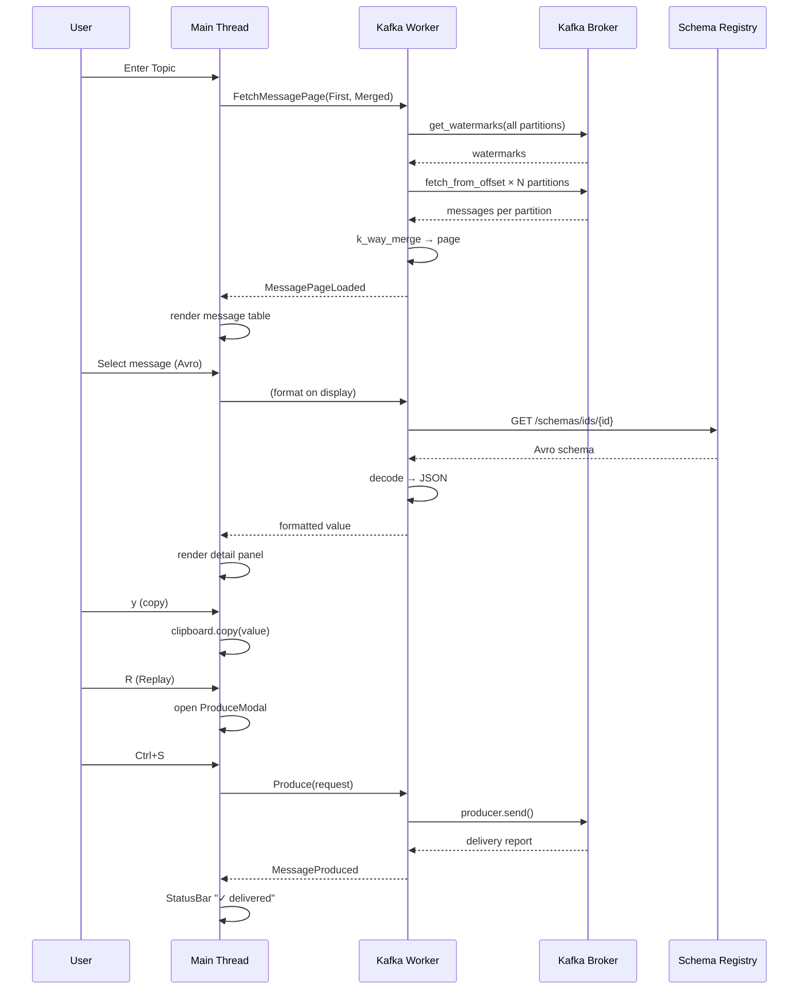

# kafka-tui — 技术实施方案

> 版本：v1.0  
> 日期：2026-06-17  
> 状态：已确认，可实施  
> 关联文档：[product-design.md](./product-design.md)

---

## 目录

1. [已确认决策](#1-已确认决策)
2. [实施范围](#2-实施范围)
3. [系统架构](#3-系统架构)
4. [依赖与工程配置](#4-依赖与工程配置)
5. [配置模块](#5-配置模块)
6. [Kafka 客户端层](#6-kafka-客户端层)
7. [Schema Registry Avro 解码](#7-schema-registry-avro-解码)
8. [多 Partition 分页引擎](#8-多-partition-分页引擎)
9. [业务服务层](#9-业务服务层)
10. [应用状态机](#10-应用状态机)
11. [UI 层实现](#11-ui-层实现)
12. [剪贴板模块](#12-剪贴板模块)
13. [只读模式与安全](#13-只读模式与安全)
14. [异步运行时设计](#14-异步运行时设计)
15. [错误处理与日志](#15-错误处理与日志)
16. [文件级实现清单](#16-文件级实现清单)
17. [测试方案](#17-测试方案)
18. [构建与部署](#18-构建与部署)
19. [实施顺序与工时估算](#19-实施顺序与工时估算)

---

## 1. 已确认决策

| # | 决策项 | 确认结果 | 技术影响 |
|---|--------|----------|----------|
| 1 | 分页模式 | **多 Partition 合并模式** | 需实现跨 partition 按 timestamp 归并排序的分页引擎 |
| 2 | 认证 | **首批支持 SASL/SSL** | rdkafka 需透传全部 security 配置；集成测试需覆盖 |
| 3 | Avro 解码 | **MVP 即支持 Schema Registry** | 引入 `schema_registry_converter` + HTTP 缓存 |
| 4 | 只读模式 | **支持 `allow-produce: false`** | UI 层禁用写入快捷键；Service 层二次校验 |
| 5 | 配置路径 | **`~/.config/kafka-tui/config.yaml`** | CLI 默认路径 + 目录自动创建提示 |
| 6 | 产品名称 | **`kafka-tui`** | binary 名、crate 名、配置目录统一 |
| 7 | 剪贴板 | **MVP 支持 Value 复制** | `arboard` + OSC 52 双通道 fallback |

---

## 2. 实施范围

本方案覆盖 [product-design.md](./product-design.md) 中 **Phase 1 + Phase 2 核心能力**，一次性交付完整可用版本：

### 2.1 必须完成（P0）

- [x] 配置：YAML 解析、环境变量替换、默认路径、校验
- [x] 多 Cluster 连接、切换、Metadata 健康检查
- [x] SASL/SSL 全量 properties 透传
- [x] Topic 列表：展示、搜索、刷新、内部 Topic 过滤
- [x] **多 Partition 合并分页浏览**（按 timestamp 排序）
- [x] 单 Partition 模式切换（精确 offset 排查）
- [x] 消息详情：Key / Value / Headers / Timestamp / Partition / Offset
- [x] 消息格式化：auto / json / raw / avro
- [x] Schema Registry Avro 自动解码
- [x] 分页：Prev / Next / Go to offset / Go to timestamp / From Beginning / From Latest
- [x] 单条 Replay + 手动 Produce
- [x] 只读模式
- [x] 剪贴板复制（Value / Key / 完整 JSON）
- [x] 全局快捷键 + 帮助页
- [x] 异步非阻塞 TUI

### 2.2 同期完成（P1）

- [x] 多页 LRU 缓存（加速来回翻页）
- [x] 配置热重载（`Ctrl+R`）
- [x] Delivery report 详情展示
- [x] 连接失败自动重试提示
- [x] 单元测试 + 集成测试框架

### 2.3 明确不做（本版本）

- Consumer Group 管理
- Topic 创建 / 删除
- 批量 Replay
- 消息导出到文件
- Protobuf / JSON Schema 解码（仅 Avro）

---

## 3. 系统架构

### 3.1 总体架构图

```
┌─────────────────────────────────────────────────────────────────┐
│                         main.rs                                  │
│  CLI 解析 → 终端初始化 → Tokio Runtime → 主循环                  │
└──────────────────────────┬──────────────────────────────────────┘
                           │
         ┌─────────────────┼─────────────────┐
         ▼                 ▼                 ▼
┌─────────────┐   ┌─────────────┐   ┌─────────────────┐
│   ui/       │   │   app/      │   │  async runtime  │
│  Ratatui    │◄──│  AppState   │◄──│  KafkaWorker    │
│  渲染+事件  │   │  状态机     │   │  (tokio task)   │
└─────────────┘   └──────┬──────┘   └────────┬────────┘
                         │                    │
                         ▼                    ▼
                  ┌─────────────┐   ┌─────────────────┐
                  │  service/   │   │    kafka/       │
                  │  业务编排   │──►│  rdkafka 封装   │
                  └──────┬──────┘   └────────┬────────┘
                         │                    │
                         ▼                    ▼
                  ┌─────────────┐   ┌─────────────────┐
                  │  format/    │   │  schema/        │
                  │  消息格式化 │   │  Avro 解码      │
                  └─────────────┘   └─────────────────┘
                         │
                         ▼
                  ┌─────────────┐
                  │  config/    │
                  │  YAML 配置  │
                  └─────────────┘
```

### 3.2 线程模型

| 线程 | 职责 | 禁止操作 |
|------|------|----------|
| 主线程 | TUI 渲染、crossterm 事件读取、AppState 更新 | 阻塞 Kafka IO |
| Tokio Worker | Kafka Admin/Consumer/Producer、Schema Registry HTTP | 直接操作 Terminal |

通信通道：

```rust
// 主线程 → Worker
mpsc::Sender<KafkaCommand>

// Worker → 主线程
mpsc::Sender<KafkaEvent>

// 主循环 tick
interval(250ms)  // loading 动画
```

---

## 4. 依赖与工程配置

### 4.1 Cargo.toml

```toml
[package]
name = "kafka-tui"
version = "0.1.0"
edition = "2021"
description = "Terminal Kafka browser and producer"
license = "MIT"

[[bin]]
name = "kafka-tui"
path = "src/main.rs"

[dependencies]
# TUI
ratatui = "0.30"
crossterm = "0.28"

# Async
tokio = { version = "1", features = ["full"] }

# Kafka
rdkafka = { version = "0.36", features = ["cmake-build", "ssl", "sasl"] }

# Schema Registry
schema_registry_converter = { version = "4.9", features = ["avro", "easy"] }

# Config & Serialization
serde = { version = "1", features = ["derive"] }
serde_yaml = "0.9"
serde_json = "1"

# CLI
clap = { version = "4", features = ["derive"] }

# Error & Logging
anyhow = "1"
thiserror = "2"
tracing = "0.1"
tracing-subscriber = { version = "0.3", features = ["env-filter"] }
tracing-appender = "0.2"

# Utilities
chrono = { version = "0.4", features = ["serde"] }
dirs = "6"
lru = "0.12"
bytes = "1"

# Clipboard
arboard = "3.6"

[dev-dependencies]
tempfile = "3"
mockito = "1"

[profile.release]
lto = true
codegen-units = 1
strip = true
```

### 4.2 系统依赖

| 平台 | 依赖 | 用途 |
|------|------|------|
| macOS | `brew install cmake openssl` | rdkafka 编译 |
| Linux | `apt install cmake libssl-dev libsasl2-dev` | rdkafka + SASL |
| 所有 | — | arboard 使用系统原生剪贴板 API |

### 4.3 特性 Flag（Cargo features）

```toml
[features]
default = []
# 集成测试需要真实 Kafka
integration-tests = []
```

---

## 5. 配置模块

**路径：** `src/config/mod.rs`

### 5.1 数据结构

```rust
#[derive(Debug, Clone, Deserialize)]
pub struct AppConfig {
    pub connections: HashMap<String, ClusterConfig>,
    #[serde(default)]
    pub topic: TopicDefaults,
    #[serde(default, rename = "topic-data")]
    pub topic_data: TopicDataConfig,
}

#[derive(Debug, Clone, Deserialize)]
pub struct ClusterConfig {
    pub properties: HashMap<String, String>,
    #[serde(default)]
    pub schema_registry: Option<SchemaRegistryConfig>,
    #[serde(default = "default_allow_produce")]
    pub allow_produce: bool,
}

#[derive(Debug, Clone, Deserialize)]
pub struct SchemaRegistryConfig {
    pub url: String,
    #[serde(default)]
    pub properties: HashMap<String, String>,  // 如 basic auth
}

#[derive(Debug, Clone, Deserialize, Default)]
pub struct TopicDataConfig {
    #[serde(default = "default_page_size")]
    pub page_size: usize,           // 50
    #[serde(default = "default_poll_timeout")]
    pub poll_timeout_ms: u64,       // 1000
    #[serde(default = "default_max_msg_len")]
    pub max_message_length: usize,  // 1_000_000
    #[serde(default = "default_format")]
    pub default_format: MessageFormat,  // auto
    #[serde(default = "default_cache_pages")]
    pub cache_pages: usize,         // 10
}

#[derive(Debug, Clone, Copy, Deserialize, Default, PartialEq)]
#[serde(rename_all = "lowercase")]
pub enum MessageFormat {
    #[default]
    Auto,
    Json,
    Raw,
    Avro,
}
```

### 5.2 配置加载流程

```
1. 解析 CLI args (--config, --cluster)
2. 确定配置文件路径：
   a. --config 指定路径
   b. ~/.config/kafka-tui/config.yaml
   c. ./config.yaml（当前目录，开发用）
3. 读取 YAML → serde 反序列化
4. 递归替换 ${ENV_VAR} 占位符
5. 校验：
   - connections 非空
   - 每个 cluster 有 bootstrap.servers
   - page_size > 0
6. 返回 AppConfig
```

### 5.3 环境变量替换

```rust
/// 支持 "${KAFKA_PASSWORD}" 和 "$KAFKA_PASSWORD" 两种写法
fn expand_env_vars(input: &str) -> Result<String, ConfigError> {
    // 正则: \$\{([^}]+)\} 或 \$([A-Z_][A-Z0-9_]*)
    // 未找到 env → ConfigError::MissingEnvVar(name)
}
```

### 5.4 SASL/SSL 配置透传

所有 `properties` 键值对 **原样** 传入 rdkafka `ClientConfig`，不做特殊处理。常用键：

| 配置键 | 示例值 |
|--------|--------|
| `bootstrap.servers` | `broker1:9092,broker2:9092` |
| `security.protocol` | `SASL_SSL` |
| `sasl.mechanism` | `PLAIN` / `SCRAM-SHA-256` / `SCRAM-SHA-512` |
| `sasl.username` | `${KAFKA_USERNAME}` |
| `sasl.password` | `${KAFKA_PASSWORD}` |
| `ssl.ca.location` | `/path/to/ca.pem` |
| `ssl.certificate.location` | `/path/to/client.pem` |
| `ssl.key.location` | `/path/to/client.key` |
| `ssl.key.password` | `${SSL_KEY_PASSWORD}` |

### 5.5 配置热重载

```
用户按 Ctrl+R
  → 主线程发送 KafkaCommand::ReloadConfig
  → Worker 重新读取 YAML
  → 若当前 cluster 配置变更 → 断开重连
  → 发送 KafkaEvent::ConfigReloaded
  → StatusBar 显示 "配置已重载"
```

---

## 6. Kafka 客户端层

**路径：** `src/kafka/`

### 6.1 模块结构

```
kafka/
├── mod.rs          # KafkaClient 聚合入口
├── admin.rs        # AdminClient：Metadata、Topic 列表
├── consumer.rs     # StreamConsumer：seek + poll
├── producer.rs     # FutureProducer：send + delivery
└── types.rs        # KafkaMessage、TopicInfo、PartitionInfo
```

### 6.2 核心类型

```rust
// src/kafka/types.rs

#[derive(Debug, Clone)]
pub struct TopicInfo {
    pub name: String,
    pub partitions: Vec<PartitionInfo>,
    pub is_internal: bool,
}

#[derive(Debug, Clone)]
pub struct PartitionInfo {
    pub id: i32,
    pub leader: i32,
    pub log_start_offset: i64,
    pub high_watermark: i64,
}

#[derive(Debug, Clone)]
pub struct KafkaMessage {
    pub topic: String,
    pub partition: i32,
    pub offset: i64,
    pub timestamp: MessageTimestamp,
    pub key: Option<Vec<u8>>,
    pub value: Option<Vec<u8>>,
    pub headers: Vec<(String, Vec<u8>)>,
}

#[derive(Debug, Clone, Copy, PartialEq, Eq, PartialOrd, Ord)]
pub struct MessageTimestamp {
    pub millis: i64,       // Unix epoch ms，CreateTime
    pub kind: TimestampKind,
}

#[derive(Debug, Clone, Copy)]
pub enum TimestampKind {
    CreateTime,
    LogAppendTime,
    NotAvailable,
}
```

### 6.3 AdminClient（admin.rs）

```rust
pub struct KafkaAdmin {
    client: AdminClient<DefaultClientContext>,
}

impl KafkaAdmin {
    pub fn new(properties: &HashMap<String, String>) -> Result<Self>;

    /// 拉取全部 Topic Metadata，含每个 partition 的 watermark
    pub async fn list_topics(&self) -> Result<Vec<TopicInfo>>;

    /// 获取单个 Topic 的 partition 水位
    pub async fn get_watermarks(
        &self,
        topic: &str,
    ) -> Result<Vec<PartitionInfo>>;

    /// 连接健康检查（Metadata 请求）
    pub async fn ping(&self) -> Result<()>;
}
```

**Watermark 获取：**

```rust
// 使用 rdkafka AdminClient 的 fetch_watermarks 或
// 临时 Consumer assign + query_watermarks
consumer.fetch_watermarks(topic, partition, timeout)?
// 返回 (low, high)
```

### 6.4 Consumer（consumer.rs）

```rust
pub struct KafkaConsumer {
    consumer: StreamConsumer,
    poll_timeout: Duration,
}

impl KafkaConsumer {
    pub fn new(properties: &HashMap<String, String>, poll_timeout_ms: u64) -> Result<Self>;

    /// 从指定 partition + offset 拉取最多 count 条消息
    pub fn fetch_from_offset(
        &self,
        topic: &str,
        partition: i32,
        start_offset: i64,
        count: usize,
    ) -> Result<Vec<KafkaMessage>>;

    /// 按 timestamp 定位 offset 后拉取
    pub fn fetch_from_timestamp(
        &self,
        topic: &str,
        partition: i32,
        timestamp_ms: i64,
        count: usize,
    ) -> Result<Vec<KafkaMessage>>;

    /// 批量从多个 partition 拉取（多 Partition 模式用）
    pub fn fetch_multi_partition(
        &self,
        assignments: &[(i32, i64)],  // (partition, start_offset)
        count_per_partition: usize,
    ) -> Result<Vec<KafkaMessage>>;
}
```

**单 Partition fetch 实现：**

```rust
pub fn fetch_from_offset(&self, topic: &str, partition: i32, start: i64, count: usize)
    -> Result<Vec<KafkaMessage>>
{
    let mut tpl = TopicPartitionList::new();
    tpl.add_partition_offset(topic, partition, Offset::Offset(start))?;
    self.consumer.assign(&tpl)?;
    self.consumer.seek(topic, partition, start, self.poll_timeout)?;

    let mut messages = Vec::with_capacity(count);
    while messages.len() < count {
        match self.consumer.poll(self.poll_timeout) {
            Some(Ok(msg)) => messages.push(KafkaMessage::from(msg)),
            Some(Err(KafkaError::PartitionEOF(_))) => break,
            Some(Err(e)) => return Err(e.into()),
            None => break,
        }
    }
    Ok(messages)
}
```

### 6.5 Producer（producer.rs）

```rust
pub struct KafkaProducer {
    producer: FutureProducer,
    timeout: Duration,
}

#[derive(Debug, Clone)]
pub struct ProduceRequest {
    pub topic: String,
    pub partition: Option<i32>,
    pub key: Option<Vec<u8>>,
    pub value: Vec<u8>,
    pub headers: Vec<(String, Vec<u8>)>,
}

#[derive(Debug, Clone)]
pub struct ProduceResult {
    pub partition: i32,
    pub offset: i64,
}

impl KafkaProducer {
    pub fn new(properties: &HashMap<String, String>) -> Result<Self>;

    pub async fn send(&self, req: ProduceRequest) -> Result<ProduceResult>;
}
```

**Headers 写入：**

```rust
let mut record = FutureRecord::to(&req.topic)
    .payload(&req.value)
    .headers(OwnedHeaders::new().insert(...));
if let Some(key) = &req.key {
    record = record.key(key);
}
if let Some(p) = req.partition {
    record = record.partition(p);
}
let delivery = self.producer.send(record, self.timeout).await?;
```

### 6.6 KafkaClient 聚合

```rust
// src/kafka/mod.rs

pub struct KafkaClient {
    pub admin: KafkaAdmin,
    pub consumer: KafkaConsumer,
    pub producer: Option<KafkaProducer>,  // allow_produce=false 时为 None
    pub cluster_name: String,
}

impl KafkaClient {
    pub fn connect(
        name: &str,
        config: &ClusterConfig,
        topic_data: &TopicDataConfig,
    ) -> Result<Self> {
        let producer = if config.allow_produce {
            Some(KafkaProducer::new(&config.properties)?)
        } else {
            None
        };
        Ok(Self {
            admin: KafkaAdmin::new(&config.properties)?,
            consumer: KafkaConsumer::new(&config.properties, topic_data.poll_timeout_ms)?,
            producer,
            cluster_name: name.to_string(),
        })
    }
}
```

---

## 7. Schema Registry Avro 解码

**路径：** `src/schema/mod.rs`

### 7.1 架构

```
KafkaMessage.value (bytes)
    │
    ▼
Confluent Wire Format 检测
    │  前 1 byte = 0x00 (magic)
    │  后 4 bytes = schema_id (big-endian u32)
    ▼
SchemaRegistryClient
    │  GET /schemas/ids/{id}
    │  LRU 缓存 schema（避免重复 HTTP）
    ▼
Avro 解码
    │  apache-avro 解码为 serde_json::Value
    ▼
JSON Pretty String → UI 展示
```

### 7.2 依赖与初始化

```rust
use schema_registry_converter::async_impl::avro::AvroDecoder;
use schema_registry_converter::async_impl::schema_registry::{SrSettings, PostSchemaReferences};

pub struct SchemaService {
    decoder: AvroDecoder<'static>,
    cache: LruCache<u32, String>,  // schema_id → schema json
}

impl SchemaService {
    pub fn new(config: &SchemaRegistryConfig) -> Self {
        let mut sr_settings = SrSettings::new(config.url.clone());
        // 透传 basic auth 等 properties
        for (k, v) in &config.properties {
            sr_settings.set(k, v);
        }
        let decoder = AvroDecoder::new(sr_settings);
        Self { decoder, cache: LruCache::new(100) }
    }

    pub async fn decode_value(
        &mut self,
        topic: &str,
        payload: &[u8],
    ) -> Result<DecodedMessage, DecodeError> {
        // 1. 检测 Confluent wire format
        if payload.len() < 5 || payload[0] != 0 {
            return Err(DecodeError::NotAvro);
        }
        // 2. 调用 decoder
        let result = self.decoder.decode(payload, None).await?;
        // 3. 转为 JSON string
        Ok(DecodedMessage {
            format: PayloadFormat::Avro,
            json: serde_json::to_string_pretty(&result)?,
            schema_id: u32::from_be_bytes(payload[1..5].try_into()?),
        })
    }
}
```

### 7.3 格式化优先级（auto 模式）

```
1. 若 cluster 配置了 schema-registry 且 payload 有 Confluent magic byte → Avro 解码
2. 若 payload 是合法 UTF-8 JSON → JSON pretty-print
3. 若 payload 是合法 UTF-8 文本 → Raw text
4. 否则 → Hex dump
```

### 7.4 错误降级

Avro 解码失败时不 crash，在详情面板显示：

```
[Avro 解码失败: schema id 42 not found]
--- Raw (hex) ---
00 00 00 00 2A 06 61 62 63 ...
```

---

## 8. 多 Partition 分页引擎

**路径：** `src/service/message.rs` + `src/service/pagination.rs`

这是本项目的 **核心技术难点**。

### 8.1 两种浏览模式

```rust
#[derive(Debug, Clone, Copy, PartialEq)]
pub enum BrowseMode {
    /// 跨 partition 按 timestamp 合并排序（默认）
    Merged,
    /// 单 partition 按 offset 翻页
    SinglePartition { partition: i32 },
}
```

### 8.2 Merged 模式 — 分页算法

#### 问题定义

给定 Topic 有 N 个 partition，每个 partition 有 `[log_start, high_watermark)` 范围。用户希望看到按 **timestamp 全局排序** 的消息页，每页 `page_size` 条。

#### 核心思路：K-Way Merge + Cursor

```
┌─────────────────────────────────────────────────────────┐
│  PageCursor（持久化在 AppState 中）                       │
│                                                         │
│  cursors: Vec<PartitionCursor>                         │
│    partition 0: next_offset = 1500                       │
│    partition 1: next_offset = 890                        │
│    partition 2: next_offset = 2100                       │
│                                                         │
│  last_page_timestamps: Vec<i64>  // 上一页最后一条的时间  │
│  direction: Forward | Backward                           │
└─────────────────────────────────────────────────────────┘
```

#### 算法步骤

**首次加载（From Beginning）：**

```
1. 获取所有 partition 的 watermarks
2. 每个 partition 从 log_start_offset 拉取 page_size 条
   → 得到 N 个有序列表（partition 内按 offset 有序 = timestamp 大致有序）
3. K-Way Merge：取全局 timestamp 最小的 page_size 条
4. 记录每个 partition 的 next_offset（该 partition 贡献的最后一条 + 1）
5. 缓存本页消息 + cursor 状态
```

**下一页（Forward）：**

```
1. 从每个 partition 的 next_offset 继续拉取 page_size 条
2. K-Way Merge 取全局最小的 page_size 条
3. 更新 cursors
```

**上一页（Backward）：**

```
1. 使用 last_page_timestamps 作为锚点
2. 每个 partition 从 log_start 拉取，过滤 timestamp < anchor 的消息
3. 取全局最大的 page_size 条（反向页）
4. 更新 cursors
```

**Go to Timestamp：**

```
1. 每个 partition 执行 offsets_for_times(timestamp)
2. 从返回的 offset 开始拉取 page_size 条
3. K-Way Merge
```

#### K-Way Merge 实现

```rust
use std::collections::BinaryHeap;
use std::cmp::Reverse;

/// 多路归并，取全局 timestamp 最小的 count 条
fn k_way_merge(
    partitions: Vec<Vec<KafkaMessage>>,
    count: usize,
) -> (Vec<KafkaMessage>, Vec<PartitionCursor>) {
    // Min-heap: (timestamp, partition_idx, msg_idx)
    let mut heap: BinaryHeap<Reverse<(i64, usize, usize)>> = BinaryHeap::new();

    for (p_idx, msgs) in partitions.iter().enumerate() {
        if !msgs.is_empty() {
            heap.push(Reverse((msgs[0].timestamp.millis, p_idx, 0)));
        }
    }

    let mut result = Vec::with_capacity(count);
    let mut cursors = vec![PartitionCursor::default(); partitions.len()];

    while result.len() < count && !heap.is_empty() {
        let Reverse((ts, p_idx, m_idx)) = heap.pop().unwrap();
        let msg = partitions[p_idx][m_idx].clone();
        result.push(msg);

        // 更新该 partition 的 cursor
        cursors[p_idx].next_offset = partitions[p_idx][m_idx].offset + 1;

        // 推进该 partition 的指针
        if m_idx + 1 < partitions[p_idx].len() {
            let next = &partitions[p_idx][m_idx + 1];
            heap.push(Reverse((next.timestamp.millis, p_idx, m_idx + 1)));
        }
    }

    (result, cursors)
}
```

### 8.3 Single Partition 模式

与 product-design 原方案一致，按 offset 翻页：

```
Page = (topic, partition, start_offset, page_size)

下一页: start_offset += page_size
上一页: start_offset = max(log_start, start_offset - page_size)
跳转:   seek(start_offset)
```

### 8.4 分页缓存（LRU）

```rust
pub struct PageCache {
    cache: LruCache<PageKey, MessagePage>,
    max_pages: usize,  // 来自 config topic-data.cache-pages
}

#[derive(Hash, Eq, PartialEq)]
pub struct PageKey {
    pub topic: String,
    pub mode: BrowseMode,
    pub page_index: u64,       // Merged 模式用序号
    pub start_offset: i64,     // Single 模式用 offset
}
```

翻页时先查缓存，命中则直接返回，未命中才发起 Kafka 请求。

### 8.5 分页 UI 状态

```rust
pub struct MessageBrowserState {
    pub topic: String,
    pub mode: BrowseMode,
    pub messages: Vec<DisplayMessage>,   // 当前页
    pub cursors: Vec<PartitionCursor>,  // Merged 模式
    pub start_offset: i64,              // Single 模式
    pub page_index: u64,                // 当前页序号（Merged）
    pub total_messages_estimate: u64,   // 所有 partition 消息总数估计
    pub loading: bool,
    pub selected: usize,
    pub detail_expanded: bool,
}

pub struct DisplayMessage {
    pub raw: KafkaMessage,
    pub formatted_value: String,
    pub preview: String,          // 截断的单行预览
    pub format: PayloadFormat,
}
```

---

## 9. 业务服务层

**路径：** `src/service/`

### 9.1 TopicService

```rust
pub struct TopicService;

impl TopicService {
    pub async fn list(
        client: &KafkaClient,
        show_internal: bool,
    ) -> Result<Vec<TopicInfo>>;

    pub fn filter(topics: &[TopicInfo], query: &str) -> Vec<TopicInfo>;
}
```

### 9.2 MessageService

```rust
pub struct MessageService {
    page_cache: PageCache,
    schema: Option<SchemaService>,
}

impl MessageService {
    pub async fn fetch_page(
        &mut self,
        client: &KafkaClient,
        topic: &str,
        mode: BrowseMode,
        direction: PageDirection,
        config: &TopicDataConfig,
    ) -> Result<MessageBrowserState>;

    pub fn format_message(
        &mut self,
        msg: &KafkaMessage,
        format: MessageFormat,
    ) -> DisplayMessage;
}

pub enum PageDirection {
    First,           // From Beginning
    Last,            // From Latest
    Next,
    Prev,
    GoToOffset(i64), // Single 模式
    GoToTimestamp(i64), // 两种模式均支持
}
```

### 9.3 ProduceService

```rust
pub struct ProduceService;

impl ProduceService {
    /// 发送前校验
    pub fn validate(
        client: &KafkaClient,
        req: &ProduceRequest,
    ) -> Result<(), ProduceError> {
        if client.producer.is_none() {
            return Err(ProduceError::ReadOnlyMode);
        }
        Ok(())
    }

    /// 执行发送
    pub async fn send(
        client: &KafkaClient,
        req: ProduceRequest,
    ) -> Result<ProduceResult>;

    /// 从已有消息构建 Replay 请求
    pub fn from_message(
        msg: &KafkaMessage,
        target_topic: &str,
        target_partition: Option<i32>,
    ) -> ProduceRequest;
}
```

---

## 10. 应用状态机

**路径：** `src/app/`

### 10.1 App 结构

```rust
pub struct App {
    // 配置
    pub config: AppConfig,
    pub config_path: PathBuf,

    // 连接
    pub current_cluster: Option<String>,
    pub connection_status: ConnectionStatus,
    pub kafka_client: Option<Arc<KafkaClient>>,

    // 导航
    pub screen: Screen,
    pub previous_screen: Option<Screen>,

    // Topic 列表
    pub topics: Vec<TopicInfo>,
    pub topic_filter: String,
    pub show_internal_topics: bool,
    pub topic_selected: usize,

    // 消息浏览
    pub message_browser: Option<MessageBrowserState>,

    // 弹窗
    pub modal: Option<Modal>,

    // 通知
    pub notification: Option<Notification>,

    // 异步
    pub pending_tasks: HashSet<TaskId>,
    pub should_quit: bool,
}

pub enum Screen {
    ClusterSelect,
    TopicList,
    MessageBrowser,
}

pub enum Modal {
    Help,
    GoToOffsetInput { input: String },
    GoToTimestampInput { input: String },
    Produce(ProduceDraft),
    ConfirmProduce { draft: ProduceDraft, message: String },
}

pub enum ConnectionStatus {
    Disconnected,
    Connecting,
    Connected,
    Failed(String),
}
```

### 10.2 事件处理

```rust
// src/app/event.rs

pub enum AppEvent {
    Key(KeyEvent),
    Kafka(KafkaEvent),
    Tick,
}

pub fn handle_event(app: &mut App, event: AppEvent, cmd_tx: &Sender<KafkaCommand>) {
    match event {
        AppEvent::Key(key) => handle_key(app, key, cmd_tx),
        AppEvent::Kafka(event) => handle_kafka_event(app, event),
        AppEvent::Tick => app.on_tick(),
    }
}
```

### 10.3 Kafka 命令与事件

```rust
pub enum KafkaCommand {
    Connect { cluster: String },
    Disconnect,
    FetchTopics,
    FetchMessagePage {
        topic: String,
        mode: BrowseMode,
        direction: PageDirection,
    },
    Produce(ProduceRequest),
    ReloadConfig,
}

pub enum KafkaEvent {
    Connected { cluster: String },
    ConnectionFailed { error: String },
    TopicsLoaded { topics: Vec<TopicInfo> },
    MessagePageLoaded { state: MessageBrowserState },
    MessagePageFailed { error: String },
    MessageProduced { result: ProduceResult },
    ProduceFailed { error: String },
    ConfigReloaded,
}
```

### 10.4 状态转换表

| 当前 Screen | 事件 | 目标 Screen | 副作用 |
|-------------|------|-------------|--------|
| ClusterSelect | Enter | TopicList | Connect + FetchTopics |
| TopicList | Enter | MessageBrowser | FetchMessagePage(First) |
| TopicList | Esc | ClusterSelect | Disconnect |
| MessageBrowser | Esc | TopicList | 清空 message_browser |
| MessageBrowser | R | Modal(Produce) | 预填 Replay draft |
| MessageBrowser | P | Modal(Produce) | 空白 draft |
| MessageBrowser | y | — | 复制 Value 到剪贴板 |
| MessageBrowser | n/p | MessageBrowser | FetchMessagePage(Next/Prev) |
| Modal(*) | Esc | 恢复 previous | 关闭弹窗 |
| Any | q | Exit | should_quit = true |

---

## 11. UI 层实现

**路径：** `src/ui/`

### 11.1 渲染路由

```rust
// src/ui/mod.rs

pub fn render(frame: &mut Frame, app: &App) {
    let area = frame.area();

    // 布局：[StatusBar: 1行] [Content: 剩余-1] [Footer: 1行]
    let [status_area, content_area, footer_area] = Layout::vertical([
        Constraint::Length(1),
        Constraint::Min(0),
        Constraint::Length(1),
    ]).areas(area);

    render_status_bar(frame, status_area, app);
    render_footer(frame, footer_area, app);

    // 若有 Modal，覆盖渲染
    if let Some(modal) = &app.modal {
        render_modal(frame, content_area, app, modal);
        return;
    }

    match app.screen {
        Screen::ClusterSelect => render_cluster_select(frame, content_area, app),
        Screen::TopicList => render_topic_list(frame, content_area, app),
        Screen::MessageBrowser => render_message_browser(frame, content_area, app),
    }
}
```

### 11.2 消息浏览 Screen 布局

```
┌─ Header ──────────────────────────────────────────────────────┐
│ Topic: order-events │ Mode: [Merged ▼] │ Partition: [All ▼]  │
├───────────────────────────────────────────────────────────────┤
│ # │ Part │ Offset │ Timestamp        │ Preview                │
├───┼──────┼────────┼──────────────────┼────────────────────────┤
│ 1 │  0   │ 1000   │ 2026-06-17 10:00 │ {"orderId":"A001"...   │
│ 2 │  2   │  890   │ 2026-06-17 10:00 │ {"orderId":"B002"...   │
│...│ ...  │  ...   │ ...              │ ...                    │
├───────────────────────────────────────────────────────────────┤
│ Message Detail（选中行展开，可折叠）                            │
│ Partition: 2  Offset: 890  Format: avro                       │
│ { "orderId": "B002", "amount": 99.9 }                         │
└───────────────────────────────────────────────────────────────┘
```

Merged 模式下表格多一列 `Part`（Partition ID）。

### 11.3 通用组件

| 组件 | 文件 | 说明 |
|------|------|------|
| StatusBar | `components/status_bar.rs` | Cluster 名、连接状态、通知 |
| Footer | `components/footer.rs` | 快捷键提示、分页信息、loading |
| Table | `components/table.rs` | 可复用表格（支持选中行高亮） |
| Input | `components/input.rs` | Go to offset/timestamp 输入框 |
| Modal | `components/modal.rs` | 居中弹窗容器 |
| Spinner | `components/spinner.rs` | 异步 loading 动画 |

### 11.4 Produce 弹窗

```
┌─ Replay Message ──────────────────────────────────────────────┐
│ Target Topic:  [order-events-test          ]                  │
│ Partition:     [auto ▼]                                       │
│ Key:           [order-12345                  ]                  │
│ Headers:       content-type: application/json                 │
│ Value:                                                          │
│ ┌───────────────────────────────────────────────────────────┐ │
│ │ {                                                         │ │
│ │   "orderId": "12345",                                     │ │
│ │   "amount": 99.9                                          │ │
│ │ }                                                         │ │
│ └───────────────────────────────────────────────────────────┘ │
│                                                               │
│          [Ctrl+S Send]  [Esc Cancel]                          │
└───────────────────────────────────────────────────────────────┘
```

只读模式下此弹窗不可打开，按 R/P 时 Footer 提示 `[只读模式，写入已禁用]`。

### 11.5 主题配色

使用 Ratatui 默认 Style，不引入额外主题系统：

```rust
pub mod theme {
    use ratatui::style::{Color, Modifier, Style};

    pub const SELECTED: Style = Style::new().bg(Color::DarkGray);
    pub const HEADER: Style = Style::new().fg(Color::Cyan).add_modifier(Modifier::BOLD);
    pub const STATUS_OK: Style = Style::new().fg(Color::Green);
    pub const STATUS_ERR: Style = Style::new().fg(Color::Red);
    pub const FOOTER: Style = Style::new().fg(Color::DarkGray);
    pub const MODAL_BORDER: Style = Style::new().fg(Color::Yellow);
}
```

---

## 12. 剪贴板模块

**路径：** `src/clipboard/mod.rs`

### 12.1 双通道策略

SSH 环境下终端剪贴板行为不一致，采用双通道 fallback：

```
copy(text)
  │
  ├─ 1. crossterm OSC 52 序列
  │     → 支持 iTerm2, Kitty, Alacritty, WezTerm, Windows Terminal
  │
  └─ 2. arboard 系统剪贴板
        → 支持 macOS 原生、X11/Wayland
```

### 12.2 实现

```rust
use std::sync::Mutex;
use arboard::Clipboard;

static CLIPBOARD: Mutex<Option<Clipboard>> = Mutex::new(None);

pub struct ClipboardService;

impl ClipboardService {
    pub fn copy(&self, text: &str) -> Result<CopyResult> {
        // 1. 尝试 OSC 52
        if try_osc52(text) {
            return Ok(CopyResult::Osc52);
        }
        // 2. 尝试 arboard
        let mut guard = CLIPBOARD.lock().unwrap();
        if guard.is_none() {
            *guard = Clipboard::new().ok();
        }
        if let Some(cb) = guard.as_mut() {
            cb.set_text(text.to_string())?;
            return Ok(CopyResult::System);
        }
        Err(CopyError::Unavailable)
    }
}

fn try_osc52(text: &str) -> bool {
    use base64::{Engine, engine::general_purpose::STANDARD};
    let encoded = STANDARD.encode(text.as_bytes());
    // ESC ] 52 ; c ; {base64} BEL
    let seq = format!("\x1b]52;c;{encoded}\x07");
    print!("{seq}");
    std::io::Write::flush(&mut std::io::stdout()).is_ok()
}
```

### 12.3 复制内容选项

| 快捷键 | 复制内容 |
|--------|----------|
| `y` | 格式化后的 Value |
| `Y` | 原始 Value bytes（UTF-8 或 hex） |
| `k` | Key |
| `c` | 完整消息 JSON（含 metadata） |

复制成功后 Footer 短暂显示 `[已复制到剪贴板]`。

---

## 13. 只读模式与安全

### 13.1 三层防护

```
Layer 1: 配置层
  allow-produce: false → KafkaClient 不创建 Producer

Layer 2: Service 层
  ProduceService.validate() → 检查 producer.is_none()

Layer 3: UI 层
  R / P / Ctrl+S 快捷键被拦截
  Produce 弹窗不可打开
  Footer 常驻提示 [只读模式]
```

### 13.2 写入二次确认

即使 `allow-produce: true`，发往非 test/dev 后缀 Topic 时需确认：

```rust
fn needs_confirmation(target_topic: &str) -> bool {
    let lower = target_topic.to_lowercase();
    !lower.ends_with("-test")
        && !lower.ends_with("_test")
        && !lower.ends_with("-dev")
        && !lower.ends_with("_dev")
        && !lower.contains("test-")
        && !lower.contains("dev-")
}
```

确认弹窗：

```
┌─ 确认发送 ──────────────────────────────────────────────────┐
│ 即将发送消息到: order-events（生产 Topic）                     │
│ 确认? [Y/N]                                                   │
└───────────────────────────────────────────────────────────────┘
```

---

## 14. 异步运行时设计

### 14.1 启动流程

```rust
// src/main.rs

fn main() -> Result<()> {
    let cli = Cli::parse();
    init_logging(&cli)?;

    let config = load_config(&cli)?;
    let terminal = init_terminal()?;

    let runtime = tokio::runtime::Builder::new_multi_thread()
        .enable_all()
        .build()?;

    let (cmd_tx, cmd_rx) = mpsc::channel(32);
    let (event_tx, event_rx) = mpsc::channel(32);

    // 启动 Kafka Worker
    runtime.spawn(kafka_worker(cmd_rx, event_tx, config.clone()));

    let mut app = App::new(config, cli);
    let mut clipboard = ClipboardService::new();

    let result = run_app(&mut terminal, &mut app, &event_rx, &cmd_tx, &mut clipboard);

    restore_terminal()?;
    result
}
```

### 14.2 主循环

```rust
fn run_app(
    terminal: &mut Terminal<CrosstermBackend<Stdout>>,
    app: &mut App,
    event_rx: &Receiver<KafkaEvent>,
    cmd_tx: &Sender<KafkaCommand>,
    clipboard: &mut ClipboardService,
) -> Result<()> {
    let tick_rate = Duration::from_millis(250);
    let mut last_tick = Instant::now();

    loop {
        terminal.draw(|f| ui::render(f, app))?;

        if app.should_quit {
            return Ok(());
        }

        let timeout = tick_rate.saturating_sub(last_tick.elapsed());
        if crossterm::event::poll(timeout)? {
            if let Event::Key(key) = event::read()? {
                if key.kind == KeyEventKind::Press {
                    handle_key(app, key, cmd_tx, clipboard);
                }
            }
        }

        // 非阻塞接收 Kafka 事件
        while let Ok(kafka_event) = event_rx.try_recv() {
            handle_kafka_event(app, kafka_event);
        }

        if last_tick.elapsed() >= tick_rate {
            app.on_tick();
            last_tick = Instant::now();
        }
    }
}
```

### 14.3 Kafka Worker

```rust
async fn kafka_worker(
    mut cmd_rx: Receiver<KafkaCommand>,
    event_tx: Sender<KafkaEvent>,
    config: AppConfig,
) {
    let mut client: Option<Arc<KafkaClient>> = None;
    let mut message_service = MessageService::new();

    while let Some(cmd) = cmd_rx.recv().await {
        match cmd {
            KafkaCommand::Connect { cluster } => {
                match connect_cluster(&config, &cluster) {
                    Ok(c) => {
                        client = Some(Arc::new(c));
                        let _ = event_tx.send(KafkaEvent::Connected { cluster }).await;
                    }
                    Err(e) => {
                        let _ = event_tx.send(KafkaEvent::ConnectionFailed {
                            error: e.to_string(),
                        }).await;
                    }
                }
            }
            KafkaCommand::FetchTopics => {
                if let Some(c) = &client {
                    match TopicService::list(c, false).await {
                        Ok(topics) => {
                            let _ = event_tx.send(KafkaEvent::TopicsLoaded { topics }).await;
                        }
                        Err(e) => { /* ... */ }
                    }
                }
            }
            KafkaCommand::FetchMessagePage { topic, mode, direction } => {
                if let Some(c) = &client {
                    match message_service.fetch_page(c, &topic, mode, direction, &config.topic_data).await {
                        Ok(state) => {
                            let _ = event_tx.send(KafkaEvent::MessagePageLoaded { state }).await;
                        }
                        Err(e) => { /* ... */ }
                    }
                }
            }
            KafkaCommand::Produce(req) => { /* ... */ }
            KafkaCommand::ReloadConfig => { /* ... */ }
            KafkaCommand::Disconnect => {
                client = None;
            }
        }
    }
}
```

---

## 15. 错误处理与日志

### 15.1 错误类型层次

```rust
// src/error.rs

#[derive(Error, Debug)]
pub enum AppError {
    #[error("配置错误: {0}")]
    Config(#[from] ConfigError),

    #[error("Kafka 错误: {0}")]
    Kafka(#[from] KafkaError),

    #[error("Schema 解码错误: {0}")]
    Schema(#[from] DecodeError),

    #[error("只读模式，禁止写入")]
    ReadOnly,

    #[error("剪贴板不可用")]
    Clipboard(#[from] CopyError),
}
```

### 15.2 UI 错误展示策略

| 错误类型 | 展示位置 | 持续时间 |
|----------|----------|----------|
| 连接失败 | StatusBar 红色 | 直到重连成功 |
| 消息拉取失败 | Footer 提示 + 保留当前页 | 5 秒后消失 |
| Produce 失败 | Modal 内联错误 | 直到用户操作 |
| 配置错误 | 启动时 stderr + exit(1) | — |
| Avro 解码失败 | 详情面板降级显示 Raw | 永久（该条消息） |

### 15.3 日志

```rust
fn init_logging(cli: &Cli) -> Result<()> {
    let log_dir = dirs::home_dir()
        .map(|h| h.join(".config/kafka-tui/logs"))
        .unwrap_or_else(|| PathBuf::from("./logs"));

    std::fs::create_dir_all(&log_dir)?;
    let file_appender = tracing_appender::rolling::daily(&log_dir, "kafka-tui.log");
    tracing_subscriber::fmt()
        .with_writer(file_appender)
        .with_env_filter("kafka_tui=debug,rdkafka=warn")
        .init();
    Ok(())
}
```

日志 **不输出到 TUI 界面**，仅写文件。日志中 **不记录消息内容**（隐私保护）。

---

## 16. 文件级实现清单

以下列出每个文件的职责与核心导出，作为开发 checklist。

### 16.1 根目录

| 文件 | 职责 | 状态 |
|------|------|------|
| `Cargo.toml` | 依赖声明 | ☐ |
| `config.example.yaml` | 示例配置 | ☐ |
| `README.md` | 安装、配置、快捷键说明 | ☐ |

### 16.2 src/

| 文件 | 核心导出 | 状态 |
|------|----------|------|
| `main.rs` | `main()`, CLI, 终端初始化, 主循环 | ☐ |
| `error.rs` | `AppError`, `ConfigError`, `KafkaError`, `DecodeError` | ☐ |

### 16.3 src/config/

| 文件 | 核心导出 | 状态 |
|------|----------|------|
| `mod.rs` | `AppConfig`, `load_config()`, `expand_env_vars()`, `default_config_path()` | ☐ |

### 16.4 src/kafka/

| 文件 | 核心导出 | 状态 |
|------|----------|------|
| `mod.rs` | `KafkaClient`, `connect()` | ☐ |
| `types.rs` | `TopicInfo`, `PartitionInfo`, `KafkaMessage`, `MessageTimestamp` | ☐ |
| `admin.rs` | `KafkaAdmin`, `list_topics()`, `get_watermarks()`, `ping()` | ☐ |
| `consumer.rs` | `KafkaConsumer`, `fetch_from_offset()`, `fetch_from_timestamp()`, `fetch_multi_partition()` | ☐ |
| `producer.rs` | `KafkaProducer`, `ProduceRequest`, `ProduceResult`, `send()` | ☐ |

### 16.5 src/schema/

| 文件 | 核心导出 | 状态 |
|------|----------|------|
| `mod.rs` | `SchemaService`, `decode_value()`, `DecodedMessage` | ☐ |

### 16.6 src/service/

| 文件 | 核心导出 | 状态 |
|------|----------|------|
| `mod.rs` | 模块 re-export | ☐ |
| `topic.rs` | `TopicService`, `list()`, `filter()` | ☐ |
| `message.rs` | `MessageService`, `fetch_page()`, `format_message()` | ☐ |
| `pagination.rs` | `BrowseMode`, `PageDirection`, `k_way_merge()`, `PageCache`, `PageCursor` | ☐ |
| `produce.rs` | `ProduceService`, `validate()`, `send()`, `from_message()` | ☐ |

### 16.7 src/clipboard/

| 文件 | 核心导出 | 状态 |
|------|----------|------|
| `mod.rs` | `ClipboardService`, `copy()`, `try_osc52()` | ☐ |

### 16.8 src/app/

| 文件 | 核心导出 | 状态 |
|------|----------|------|
| `mod.rs` | 模块 re-export | ☐ |
| `state.rs` | `App`, `Screen`, `Modal`, `ConnectionStatus`, `MessageBrowserState` | ☐ |
| `event.rs` | `handle_key()`, `handle_kafka_event()`, `KafkaCommand`, `KafkaEvent` | ☐ |

### 16.9 src/ui/

| 文件 | 核心导出 | 状态 |
|------|----------|------|
| `mod.rs` | `render()`, `theme` | ☐ |
| `cluster.rs` | `render_cluster_select()` | ☐ |
| `topic_list.rs` | `render_topic_list()` | ☐ |
| `message_browser.rs` | `render_message_browser()` | ☐ |
| `message_detail.rs` | `render_message_detail()` | ☐ |
| `produce_modal.rs` | `render_produce_modal()` | ☐ |
| `help.rs` | `render_help()` | ☐ |
| `components/mod.rs` | re-export | ☐ |
| `components/status_bar.rs` | `render_status_bar()` | ☐ |
| `components/footer.rs` | `render_footer()` | ☐ |
| `components/table.rs` | `SelectableTable` widget | ☐ |
| `components/input.rs` | `TextInput` widget | ☐ |
| `components/modal.rs` | `render_modal_frame()` | ☐ |
| `components/spinner.rs` | `Spinner` widget | ☐ |

### 16.10 tests/

| 文件 | 测试内容 | 状态 |
|------|----------|------|
| `config_test.rs` | YAML 解析、env 替换、校验、默认值 | ☐ |
| `pagination_test.rs` | k_way_merge 算法、边界条件 | ☐ |
| `format_test.rs` | JSON/Raw/Avro 格式化优先级 | ☐ |

---

## 17. 测试方案

### 17.1 单元测试

| 模块 | 测试用例 |
|------|----------|
| config | 正常 YAML 解析；缺失 env var 报错；默认值填充；`${VAR}` 和 `$VAR` 替换 |
| pagination | 空 partition merge；单 partition；多 partition 等 timestamp；不足 page_size |
| format | JSON 检测；非 UTF-8 hex；Avro magic byte 检测；截断逻辑 |
| produce | 只读模式拒绝；needs_confirmation 判断 |

### 17.2 集成测试

需要 Docker Compose 启动 Kafka + Schema Registry：

```yaml
# docker-compose.test.yml
services:
  zookeeper:
    image: confluentinc/cp-zookeeper:7.6.0
  kafka:
    image: confluentinc/cp-kafka:7.6.0
    environment:
      KAFKA_AUTO_CREATE_TOPICS_ENABLE: "true"
  schema-registry:
    image: confluentinc/cp-schema-registry:7.6.0
```

| 测试 | 验证 |
|------|------|
| connect_plain | PLAINTEXT 连接 localhost:9092 |
| list_topics | 返回 auto-created topics |
| fetch_messages | 生产 100 条后分页拉取 |
| merged_pagination | 3 partition 各 50 条，Merged 模式翻 3 页 |
| produce_and_verify | 发送后在 Consumer 中验证 |
| avro_decode | 注册 Avro schema 后生产/消费/解码 |
| sasl_scram | SASL_SCRAM_SHA_256 认证连接 |
| readonly_mode | allow-produce=false 时 Produce 被拒绝 |

运行：

```bash
docker compose -f docker-compose.test.yml up -d
cargo test --features integration-tests -- --test-threads=1
docker compose -f docker-compose.test.yml down
```

### 17.3 手动测试清单

- [ ] 启动 `./target/release/kafka-tui`，加载默认配置
- [ ] 切换 Cluster，观察 StatusBar 连接状态
- [ ] Topic 列表搜索 `/order`
- [ ] Merged 模式浏览，翻页 5 页，确认 timestamp 排序
- [ ] 切换到 Single Partition 模式，Go to offset
- [ ] Go to timestamp 跳转
- [ ] 选中 Avro 消息，确认解码展示
- [ ] 按 `y` 复制 Value，粘贴验证
- [ ] Replay 消息到 test topic
- [ ] 手动 Produce JSON 消息
- [ ] 只读 Cluster 下 R/P 被禁用
- [ ] SASL_SSL Cluster 连接
- [ ] Ctrl+R 热重载配置
- [ ] `q` 退出，终端恢复正常

---

## 18. 构建与部署

### 18.1 本地开发

```bash
# 安装系统依赖 (macOS)
brew install cmake openssl

# 开发运行
cargo run -- --config config.example.yaml

# 带日志
RUST_LOG=kafka_tui=debug cargo run
```

### 18.2 Release 构建

```bash
cargo build --release
# 产物: target/release/kafka-tui
```

### 18.3 安装

```bash
cargo install --path .
# 安装到 ~/.cargo/bin/kafka-tui

# 首次使用
mkdir -p ~/.config/kafka-tui
cp config.example.yaml ~/.config/kafka-tui/config.yaml
# 编辑配置
kafka-tui
```

### 18.4 CLI 参数

```
kafka-tui [OPTIONS]

Options:
  -c, --config <FILE>    配置文件路径 [default: ~/.config/kafka-tui/config.yaml]
      --cluster <NAME>   启动时直接连接指定 Cluster
  -v, --verbose          启用 debug 日志
  -h, --help             帮助
  -V, --version          版本
```

---

## 19. 实施顺序与工时估算

按依赖关系排序，建议 5 个 Sprint 完成：

### Sprint 1：基础设施（3 天）

| 任务 | 文件 | 估时 |
|------|------|------|
| 项目脚手架 + Cargo.toml | 根目录 | 2h |
| 配置模块（YAML + env + 校验） | `config/` | 4h |
| 错误类型定义 | `error.rs` | 2h |
| Kafka AdminClient（list topics + watermarks） | `kafka/admin.rs` | 4h |
| 配置单元测试 | `tests/config_test.rs` | 2h |
| config.example.yaml + README 初稿 | 根目录 | 2h |

**交付物：** 能加载配置、连接 Kafka、拉取 Topic 列表（CLI 输出验证）。

### Sprint 2：Kafka 核心 + 单 Partition 浏览（4 天）

| 任务 | 文件 | 估时 |
|------|------|------|
| KafkaConsumer（fetch_from_offset/timestamp） | `kafka/consumer.rs` | 6h |
| KafkaProducer（send + headers） | `kafka/producer.rs` | 4h |
| KafkaClient 聚合 | `kafka/mod.rs` | 2h |
| 消息格式化（JSON/Raw/截断） | `service/message.rs` | 4h |
| 单 Partition 分页逻辑 | `service/pagination.rs` | 4h |
| App 状态机骨架 | `app/` | 4h |
| 异步 Worker 框架 | `main.rs` | 4h |

**交付物：** 异步拉取单 Partition 消息分页（无 UI，日志验证）。

### Sprint 3：多 Partition 分页 + Schema Registry（4 天）

| 任务 | 文件 | 估时 |
|------|------|------|
| K-Way Merge 算法 | `service/pagination.rs` | 6h |
| Merged 模式翻页（Forward/Backward） | `service/pagination.rs` | 4h |
| Go to Timestamp | `kafka/consumer.rs` | 3h |
| PageCache LRU | `service/pagination.rs` | 3h |
| Schema Registry Avro 解码 | `schema/mod.rs` | 6h |
| 分页 + 格式化单元测试 | `tests/` | 4h |

**交付物：** 完整的分页引擎 + Avro 解码（单元测试覆盖）。

### Sprint 4：TUI 全屏实现（5 天）

| 任务 | 文件 | 估时 |
|------|------|------|
| 终端初始化 + 主循环 | `main.rs` | 3h |
| 通用组件（StatusBar/Footer/Table/Modal/Input/Spinner） | `ui/components/` | 6h |
| Cluster 选择 Screen | `ui/cluster.rs` | 2h |
| Topic 列表 Screen | `ui/topic_list.rs` | 3h |
| 消息浏览 Screen（含 Detail 面板） | `ui/message_browser.rs`, `message_detail.rs` | 8h |
| Produce/Replay 弹窗 | `ui/produce_modal.rs` | 4h |
| 帮助页 | `ui/help.rs` | 2h |
| 全部快捷键绑定 | `app/event.rs` | 4h |
| 只读模式 UI 拦截 | `app/event.rs` | 2h |

**交付物：** 完整可交互 TUI。

### Sprint 5：剪贴板 + 安全 + 集成测试 + 收尾（3 天）

| 任务 | 文件 | 估时 |
|------|------|------|
| 剪贴板模块（OSC 52 + arboard） | `clipboard/mod.rs` | 3h |
| 只读模式 Service 层校验 | `service/produce.rs` | 2h |
| 写入二次确认 | `app/event.rs`, `ui/` | 2h |
| 配置热重载 | `config/`, `app/event.rs` | 3h |
| SASL/SSL 集成测试 | `docker-compose.test.yml`, `tests/` | 4h |
| Avro 集成测试 | `tests/` | 3h |
| 日志系统 | `main.rs` | 2h |
| README 完善 | `README.md` | 2h |
| Release 构建验证 | — | 2h |

**交付物：** 完整可发布版本。

### 总工时

| Sprint | 天数 | 累计 |
|--------|------|------|
| Sprint 1 | 3 | 3 |
| Sprint 2 | 4 | 7 |
| Sprint 3 | 4 | 11 |
| Sprint 4 | 5 | 16 |
| Sprint 5 | 3 | 19 |

**总计约 19 个工作日（~4 周）。**

---

## 附录 A：config.example.yaml 完整示例

```yaml
connections:
  my-cluster:
    properties:
      bootstrap.servers: "kafka-broker-1:9092,kafka-broker-2:9092"
      security.protocol: "SASL_SSL"
      sasl.mechanism: "SCRAM-SHA-512"
      sasl.username: "${KAFKA_USERNAME}"
      sasl.password: "${KAFKA_PASSWORD}"
      ssl.ca.location: "/etc/kafka/ca.pem"
    schema-registry:
      url: "http://schema-registry:8081"
    allow-produce: true

  dev-cluster:
    properties:
      bootstrap.servers: "localhost:9092"
    allow-produce: true

  prod-readonly:
    properties:
      bootstrap.servers: "prod-broker:9092"
      security.protocol: "SASL_SSL"
      sasl.mechanism: "PLAIN"
      sasl.username: "${KAFKA_USERNAME}"
      sasl.password: "${KAFKA_PASSWORD}"
    schema-registry:
      url: "http://prod-schema-registry:8081"
    allow-produce: false

topic:
  replication: 3
  partition: 3

topic-data:
  page-size: 50
  poll-timeout-ms: 1000
  max-message-length: 1000000
  default-format: auto
  cache-pages: 10
```

## 附录 B：Kafka Worker 与主线程交互时序


